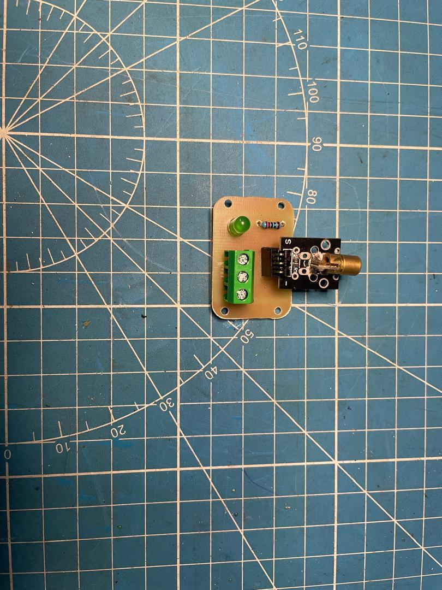

## 3. Parts Design

We used the KiCad EDA (_download [here](https://www.kicad.org/)_) to design the schematic as well as the Printed Circuit Boards (PCBs) for this project. Find its official documentation [here](https://docs.kicad.org/).

### a. KiCad schematic diagram

### b. Custom Arduino Nano PCB

This circuit is a faithful and functional reproduction of an Arduino Uno board, built around the ATmega328P-P microcontroller, with complete power management, programming, and expansion interfaces. This design aims to provide a standalone board that is fully compatible with various embedded modules.

  

#### Main Components

* ATmega328P microcontroller — the heart of the system, running at 16 MHz.
* 16 MHz quartz crystal with two 22 pF capacitors — ensures stable clock signal.
* Push button with 10 kΩ pull-up resistor — enables manual system reset.
* LM7809 voltage regulator — steps down input voltage to 9V.
* 1N4007 diode — protects the circuit from polarity reversal.
* 1N4733A Zener diode (5.1V) — provides 5V for logic-level components.
* 220 µF electrolytic capacitors — filter and stabilize power.
* CH340G USB-to-serial chip — allows programming via USB.
* Terminal blocks and female headers — provide access to power and I/O pins.
* Red and green LEDs — indicate presence of 9V and 5V power, respectively.

#### Functions

* Accepts 14.7V DC input, protected by a diode and regulated to:
  * 9V via LM7809 (for motors or modules).
  * 5V via Zener diode (for logic and sensors).
* Provides USB interface for code upload using CH340G.
* Supports manual reset via button.
* Offers headers for all GPIO and analog pins.
* Designed to be compatible with external modules like:
  * KY-008 laser module
  * Photoresistor sensor
  * TCS34725 color sensor
  * A4988 stepper driver

### c. KY-008 Laser Module PCB

This PCB is designed to host and drive the KY-008 laser module, used to detect the passage of an object on the conveyor belt. It is permanently activated as defined in the Arduino code.

  

####  Components:

* KY-008 laser: inserted into a 3-pin female header (VCC, GND, Signal).
* 3V green LED + 220 ohm resistor: indicates the active state of the laser module (functions as a power indicator).
* 3-pin terminal block: to connect the module to the Arduino board or another control board. This terminal block provides power (VCC/GND) and optionally the ON/OFF signal.

#### Function:

* The laser is permanently powered via the `digitalWrite(laserPin, HIGH)` pin in the `KY008` code.
* The LED indicator indicates whether the power supply is active.
* The card serves as a compact interface, reducing bulky wiring, while being modular: it can be connected or replaced without major intervention.

### d. Photoresistor Module PCB

This PCB is responsible for detecting an object passing in front of the laser by measuring the change in light. It is used in `Photoresistor::isHit()` to enable or disable sorting.

  

####  Components:

* Photoresistor (LDR): Detects ambient light.
* 10 kΩ Potentiometer (RV1): Dynamically adjusts the detection threshold based on lighting conditions.
* 10 kΩ Resistor (R5): Forms a divider bridge with the LDR to provide a variable analog voltage.
* 3V Green LED + 220 ohm Resistor (R6): Indicator indicating detection or simply power on.

* 2 2-pin terminal blocks:

* One for the power supply (VCC/GND).
* Another for the analog output (signal from the LDR or potentiometer).

#### Function:

* The system reads the voltage on the LDR (`photoPin = A0`) and compares it to the voltage from the potentiometer (`thresholdPin = A1`).
* If the voltage exceeds, the `isHit()` method returns `true`, triggering the motor to stop.
* This PCB is highly configurable via the potentiometer, making it robust in a variety of lighting environments.

### e. TCS34725 Color Sensor PCB

This PCB manages the power and I2C connections required to operate the TCS34725 color sensor, which is used to classify objects by color.

  

####  Components:

* TCS34725: inserted via a 7-pin female header (SDA, SCL, LED, INT, GND, VCC, etc.).
* 3V green LED + 220 ohm resistor: ensures uniform illumination of the detected surface.
* 2 2-pin terminal blocks:

* One for power.
* Another to extend the I2C lines or retrieve signals.

#### Function:

* The sensor is queried via I2C in the `TCS34725::detectColor()` class.
* The R, G, and B components are normalized to classify objects (code via `if (r > 0.45 && g < 0.4 && ...)`).
* The PCB is fully modular: it plugs into a motherboard without direct soldering, and can be easily removed.

### A4988 Stepper Motor Driver PCB

This PCB is intended to host anA4988 driver to control a NEMA 17 stepper motor. It is designed to facilitate power, control, and motor connections. It is  an  to control the Nema 17 stepper motor, responsible for the mechanical sorting.

  

####  Components:

* A4988 (Pololu module): inserted via a double-row female header.
* 3V green LED + 220 ohm resistor (D4 + R2): logic operation indicator.
* 3 2-pin terminal blocks:

* VDD/GND terminal block: for the A4988 logic power supply (5V).
* VMOT/GND terminal block: for the motor power supply (e.g., 12V).
* SIGNAL Terminal Block: To connect the STEP, DIR, ENABLE signals from the Arduino board.
* 4-pin Male Header:

* To directly connect the NEMA 17 motor (1A, 1B, 2A, 2B).

#### Function:

* The code controls the motor via `digitalWrite(stepPin, HIGH)` in the `Nema17` class.
* The driver receives STEP pulses to rotate the motor according to the sorting requirements.
* The motor power supply is isolated from the logic, ensuring electrical stability.

####  Advantages:

* The PCB offers clear connection (each function has its own terminal block).
* It is modular: each component (driver, motor) can be replaced without modifying the other parts. * The use of headers makes the system easy to maintain or modify.
